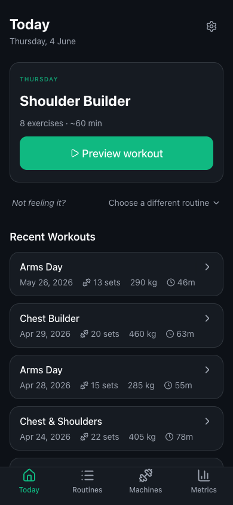
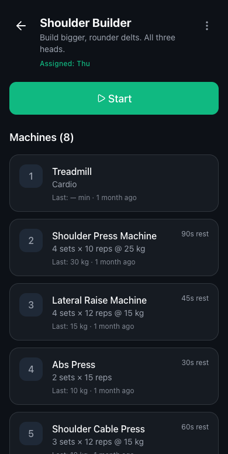
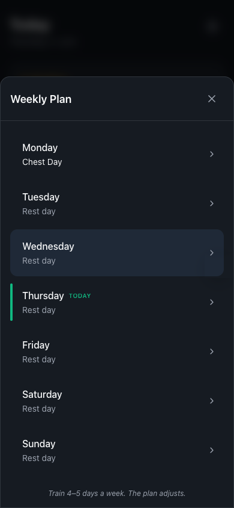
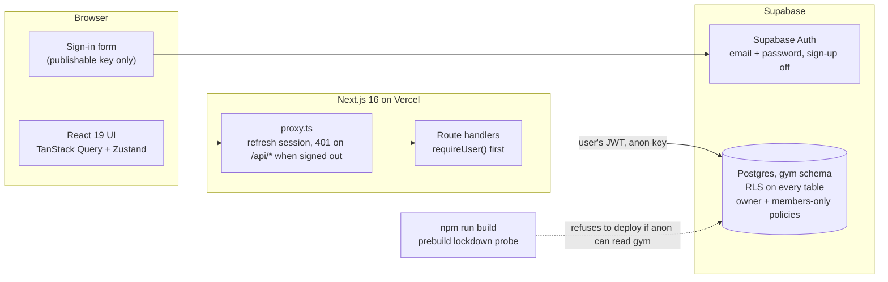

# Gym Routine Builder

A mobile-first web app for planning machine-based gym routines and running them set by set.

**Live:** https://gym-routine-builder.vercel.app (members only: accounts are created by the owner, there is no public sign-up)

| Today | Routine preview | Weekly plan |
|---|---|---|
|  |  |  |

## Why I built it

I train on machines, and I kept losing track of what weight I used last time and which routine was due. Notes apps don't time rest periods. So I built the tool I wanted on my phone between sets, then used it as a place to do auth and row-level security properly on a real app with real data.

## Features

- **Routine builder:** pick machines from a catalogue, set sets, reps, rest and starting weight, and drag to reorder.
- **Weekly plan:** assign routines to weekdays. Today shows the routine that's due, with a quick way to swap it.
- **Routine preview:** every machine with the weight and reps you used last time.
- **Guided workout player:** work set, rest timer, hydration reminder between machines, then a summary. An unfinished workout can be resumed.
- **History and metrics:** past sessions, volume and progress per machine.
- **Machine catalogue:** brand, description and a how-to video link for each machine.

## Architecture



The browser never talks to the database directly. It signs in with Supabase Auth, then calls the app's own API routes. Each route handler builds a Supabase client from the public key plus the caller's session cookie, so every query runs as that user and Postgres decides what they can see.

## Security

Security here is enforced in the database, with the app as a second layer, not the other way round.

- **Authentication.** Email and password through Supabase Auth. The app has no sign-up page and sign-ups are disabled on the project. Sessions live in cookies managed by `@supabase/ssr` and are refreshed server-side.
- **Authorization in Postgres.** Every table in the `gym` schema has row-level security with one policy per operation. Routines, items, sessions and sets carry a `user_id` and are readable and writable only by their owner. `with check` pins `user_id = auth.uid()`, so nobody can create rows for someone else or attach their rows to another user's routine. The machine catalogue is read-only. The `anon` role has no access to the schema at all.
- **Members-only gate.** Signing in is not enough. A restrictive policy on every table requires `gym.is_member()`, and Postgres ANDs it into every other policy, including any added later. Only an operator in the SQL editor can add a member. The app and its users can neither read nor write the members table.
- **No service-role key in the app.** Nothing under `src/` can bypass RLS. The service-role key exists only for local seed scripts in `scripts/`, which the app never imports.
- **A build that refuses to ship an unlocked database.** `npm run build` runs `scripts/check-db-lockdown.mjs` first. On Vercel, production and previews, the build fails unless reading `gym` as `anon` is denied and the membership gate exists. It uses only the public key and reads no rows. This makes "run the SQL before you deploy" a hard gate instead of a checklist item.
- **Every handler guarded.** All API route handlers call `requireUser()` before doing anything. It verifies the JWT signature, so a forged cookie is rejected in the app as well as in the database. Every request that changes data is a POST, PUT, PATCH or DELETE; no GET has side effects, which keeps SameSite cookies effective against CSRF.
- **Safe redirects after sign-in.** `?next=` must resolve to a same-origin path (`src/lib/safe-next.ts`, unit-tested). Backslashes, control characters, `//` and anything that parses to another origin fall back to `/`.
- **Security headers** on every response (`next.config.ts`): a Content-Security-Policy with `frame-ancestors 'none'`, `object-src 'none'` and `connect-src` limited to the app and its Supabase project, plus HSTS, `X-Content-Type-Options`, `X-Frame-Options`, `Referrer-Policy` and `Permissions-Policy`.
- **Hardened database functions.** The RPCs are `SECURITY INVOKER` with an empty `search_path` and fully qualified names. The one `SECURITY DEFINER` function (`is_member`) only answers for the caller.
- **CI.** Lint, type check, unit tests, production build and `npm audit` on every push and pull request, plus a gitleaks scan of the full git history. Actions are pinned to commit SHAs with read-only permissions, and Dependabot keeps dependencies and actions current.

A known limit: access tokens are JWTs verified locally, so a token stays valid until it expires (one hour by default) even after sign-out.

Found a problem? See [SECURITY.md](SECURITY.md).

## Engineering notes

- **Next.js 16 App Router** with a `proxy.ts` (the new name for middleware) that refreshes the session and redirects signed-out visitors. The proxy is the UX layer only; the real gates are `requireUser()` and RLS.
- **Data flow:** TanStack Query for server state with a 60-second stale time, Zustand for the workout player (`idle`, `working`, `resting`, `hydrating`, `summary`).
- **Weekday handling:** weekdays are stored as `0 = Sunday ... 6 = Saturday`, the convention JavaScript and Postgres share, and "today" is computed on the device, so the plan follows the phone's calendar day wherever the server runs.
- **Last-used weight** comes from one Postgres function rather than client-side grouping, and the weekly plan is written by a single RPC so the one-routine-per-day rule is applied in one transaction.
- **Ordered, idempotent migrations.** Each launch migration checks that the ones it depends on have run and stops with an error naming the missing step. Details in [docs/launch-checklist.md](docs/launch-checklist.md).
- **Tests:** `node:test` unit tests for the redirect validator, including the browser-parsing edge cases below.
- **Agent guide:** [CLAUDE.md](CLAUDE.md) holds the security rules for AI-assisted changes (never import a service-role client, every handler calls `requireUser()`, every new table gets RLS and the members policy).

## What I learned

The first version of this app was insecure, and fixing it taught me more than building it.

- **"The key is server-only" doesn't mean the data is safe.** v1 had no login. Its API routes used the Supabase service-role key, which bypasses RLS, and anyone who found the routes could read and change the data through them. The key never reached the browser, but the server had become an open door to the database. An independent security review caught it. The fix was to remove the service-role key from every request path, add Supabase Auth with RLS so each query runs as the signed-in user, retire the old key from the host, and rotate it.
- **RLS off plus an exposed schema is a public database.** Keeping the key off the client doesn't help if Postgres itself lets `anon` in. Row-level security has to be on for every table, and the check is one query: `select relname ... where not relrowsecurity` must return nothing.
- **Authentication, authorization and membership are three different things.** Login stopped strangers reading my data. RLS stopped users reading each other's. Neither stopped a stranger from creating an account, which is why the members gate exists.
- **Migrations go before deploys, and a build can enforce that.** The auth build ships a public key to the browser. Deployed before the database was locked down, the fix would have widened the hole. The prebuild probe turns that ordering rule into a failing build.
- **`startsWith("/")` is not URL validation.** Browsers treat `\` like `/` and strip tabs and newlines, so `/\evil.example` is an off-site redirect. Parse the URL and compare origins.

## Run locally

Requirements: Node 22 (see `.nvmrc`) and a Supabase project of your own.

```bash
npm ci
cp .env.example .env.local   # then fill in the two NEXT_PUBLIC_ values
npm run dev
```

Database, for a new Supabase project:

1. Run `supabase/schema.sql` in the SQL editor.
2. Add `gym` to the exposed schemas (Project Settings > API).
3. Create your user under Authentication > Users > Add user.
4. Make yourself a member: `insert into gym.members (user_id) select id from auth.users where email = '<EMAIL>';`

Then open http://localhost:3000 and sign in.

```bash
npm run lint      # ESLint
npx tsc --noEmit  # type check
npm test          # unit tests (node:test)
npm run build     # production build; CHECK_DB_LOCKDOWN=1 runs the lockdown probe locally
```

The optional seed scripts in `scripts/` use a service-role key from `.env.local`. Keep that key local and never set it on the host.

## License

[MIT](LICENSE) © 2026 Diego Bauer
